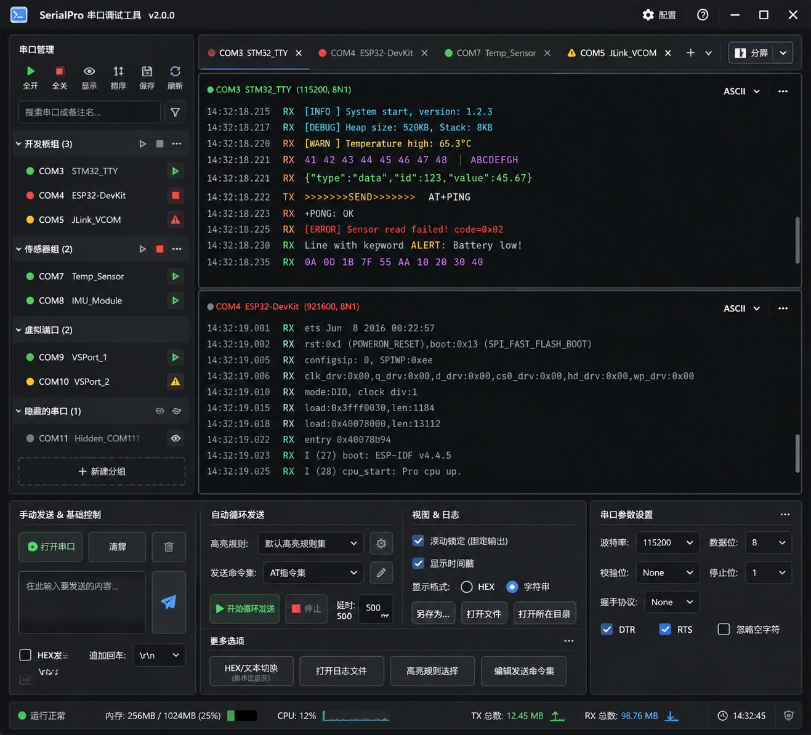

# HyperCom

一款现代化的串口调试工具，基于 **Tauri v2 + React 18 + Rust** 构建。面向嵌入式开发场景，目标是替代 SSCOM / SuperCom 等传统工具。

> 核心理念：**Rust 处理底层性能，React 负责 UI 交互**。



> **Developer reference**: see [`AGENTS.md`](AGENTS.md) for architecture, code map, and gotchas.

---

## 功能特性

### 串口与连接
- 🔌 **自动枚举** — 每 3 秒刷新，`mergePorts` 保留连接态、别名、分组
- 🧪 **模拟串口** — `SIM:Loopback` 虚拟端口，无硬件调试
- ⚙️ **完整参数** — 波特率（含自定义）、数据位、停止位、校验位、流控、DTR/RTS
- 🗂️ **分组管理** — 自定义分组、备注名、搜索过滤、跨组拖拽排序

### 终端与显示
- 📑 **多标签 + 分屏** — 上下/左右分屏、跨 Pane 拖拽、`@dnd-kit` 排序
- ⏪ **日志回放** — 按原始时间戳写回终端，倍速可选（1/4/16/最快）
- ⚡ **虚拟滚动** — `@tanstack/react-virtual`，DOM 约 30–50 节点
- 🧩 **RX 行聚合** — 字节级 CR/LF/CRLF 切行 + rAF 批写，跨事件响应不再碎成多行，高频流不掉帧
- 📌 **滚动锁定 + 快捷跳转** — 显式意图锁定（不再被输出顶开），滚动条两端一键到顶/到底
- 🎨 **语法高亮** — 正则 / 关键词规则集，可配置颜色、加粗、斜体
- 📅 **时间戳 / TX·RX 着色** — 多种格式、字符串/HEX/二进制切换（per-tab）
- 🌐 **编码实时切换** — UTF-8 / GBK / ISO-8859-1 / ASCII，切换时自动重解码
- 🌗 **暗色 / 亮色 / 跟随系统** — CSS 变量主题

### 收发与命令
- ✉️ **手动发送** — 字符串 / HEX（双向转换、输入净化）/ 自定义行结束符
- 📝 **发送历史** — 会话内存态（每端口 50 条），↑/↓ 键回溯
- 🔁 **循环发送** — 命令集顺序执行、单条延时、整体 `loopDelay`
- 📦 **命令集编辑器** — config.json 持久化，可配类型、内容、行结束符、延时
- 📤 **文件发送** — 分块发送 + 实时进度条
- 🔢 **批量发送** — 指定重复轮数（0=无限），逐条延时

### 日志与导出
- 📝 **自动日志** — 每端口独立 `BufWriter`，连接即写、断开 `sync_all`
- 🪓 **分片续写** — 按大小阈值切片，文件名模板支持变量
- 🌐 **多编码** — UTF-8 / GBK / ISO-8859-1 / ASCII
- 💾 **数据导出** — 右键导出 TXT/CSV 真实文件
- 📂 **另存 / 打开文件 / 打开目录** — `canonicalize` 作用域校验

### 系统与配置
- 📊 **资源监控** — `sysinfo` 进程级 CPU / 内存采样
- 🛠️ **7 页配置弹窗** — 通用、日志、备份、显示、高亮规则、命令规则、条件触发
- 🔄 **配置版本化** — `config_version` + `migrate()`，前向兼容
- 🎯 **配置路径** — CLI `--config` / `HYPERCOM_CONFIG` env / portable 模式
- ✅ **字段校验** — `validate_and_clamp()` 强制边界
- 💾 **备份/恢复** — `.bak` 自动备份，损坏时回退恢复
- 🔋 **防休眠** — 跨平台（Win32 / macOS `caffeinate` / Linux `systemd-inhibit`）
- ⚡ **条件触发器** — 接收匹配（包含/精确/正则/HEX）→ 自动回复 / 弹窗告警 / 书签标记
- 📌 **窗口置顶** / ℹ️ **关于** / 📤 **配置导出导入** / ⭐ **端口预设** / 🧰 **系统托盘**

---

## 技术栈

### 前端

| 包 | 版本 | 用途 |
|----|------|------|
| `react` / `react-dom` | ^18.3.1 | UI 框架 |
| `typescript` | ^5.6.3 | 类型系统 |
| `vite` | ^5.4.10 | 构建工具 |
| `zustand` + `immer` | ^5.0.13 / ^11.1.6 | 状态管理（4 store） |
| `@dnd-kit` | ^6.3.1 | 拖拽（侧边栏、标签页） |
| `@tanstack/react-virtual` | ^3.13.15 | 终端虚拟滚动 |
| `@tauri-apps/api` | ^2.0.0 | Tauri 桥接 |
| `@tauri-apps/plugin-dialog` / `shell` | ^2.7.1 / ^2.0.0 | 文件对话框 / 外部链接 |
| `lucide-react` | ^1.14.0 | 图标 |
| `vitest` | ^4.1.7 | 单元测试 |

> 全局 CSS Variables，按组件拆分到 `src/styles/`（10 组件 CSS + `base.css`），无 CSS-in-JS。

### 后端

| Crate | 版本 | 用途 |
|-------|------|------|
| `tauri` | 2.11 | 桌面框架 |
| `serialport` | 4 | 串口 I/O |
| `tokio` | 1 (full) | 异步运行时 |
| `sysinfo` | 0.33 | CPU / 内存采样 |
| `serde` / `serde_json` | 1 | 序列化 |
| `encoding_rs` | 0.8 | GBK 等多编码解码 |
| `chrono` / `dirs` / `uuid` | — | 时间 / 目录 / ID |
| `thiserror` | 1 | `CommandError` 枚举 |

> `@tauri-apps/api`（npm）与 `tauri`（Cargo）次版本必须一致，当前均为 **2.11.x**。

---

## 快速开始

### 环境要求

| 项 | 版本 | 说明 |
|----|------|------|
| **Node.js** | ≥ 18 | 前端构建 |
| **Rust** | stable | [rustup](https://rustup.rs/) |
| **VS Build Tools** | 2019+ | 「使用 C++ 的桌面开发」 |
| **WebView2** | — | Win11 自带；Win10 [手动安装](https://developer.microsoft.com/microsoft-edge/webview2/) |

### 安装与开发

```bash
npm install
npm run tauri dev
```

> PowerShell 执行策略阻塞时：`cmd /c "npm run tauri dev"`

### 生产构建

```bash
npm run tauri build
```

产物：`src-tauri/target/release/bundle/` (MSI + NSIS)

### 检查与测试

```bash
npx tsc --noEmit                                       # TypeScript
cargo check --manifest-path src-tauri/Cargo.toml       # Rust
npm run test:run                                       # vitest (400 cases / 19 files)
cargo test --lib --manifest-path src-tauri/Cargo.toml  # Rust 单元测试 (38 cases)
```

---

## 使用说明

1. **连接**：侧边栏选串口（或启用 `SIM:Loopback`）→ OperationPanel 配参数 → 点连接
2. **收发**：发送区输入字符串/HEX → Enter 发送（设置可改为 Enter 插入换行）；Shift/Ctrl+Enter 始终换行；↑/↓ 回溯历史
3. **循环发送**：选命令集 → 启动；每条可配 `delay`，整体 `loopDelay`
4. **分屏**：TabBar 右端分屏按钮 → 拖拽标签移动
5. **规则**：配置弹窗 → 高亮/命令规则标签页 → config.json 持久化
6. **日志**：连接即自动写日志；回放/另存/导出在 OperationPanel 顶栏

详细数据流见 [`plans/04-data-flow.md`](plans/04-data-flow.md)。

---

## 许可证

MIT License

## 贡献

欢迎 Issue 与 Pull Request。提交前请确保：

- `npx tsc --noEmit` 0 错误
- `cargo check --manifest-path src-tauri/Cargo.toml` 0 错误 0 警告
- `npm run test:run` 全部通过
- `cargo test --lib --manifest-path src-tauri/Cargo.toml` 全部通过
- 遵循 [`AGENTS.md`](AGENTS.md) 的开发约束
