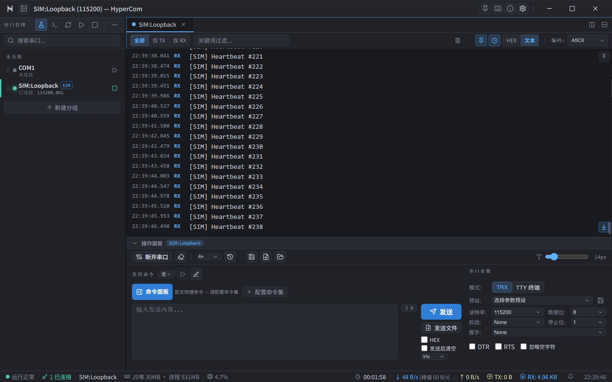

# HyperCom

HyperCom 是一款串口调试工具。连接开发板、传感器等串口设备后，可以查看设备发来的数据、发送指令，并保存收发记录。

## 特色功能

### 多设备一起调试

- **多串口标签与分屏**：同时查看多个设备，把标签拖到左右或上下分屏对照；给端口加备注、分组，快速找到常用设备。关闭标签不会断开串口，日志也会继续记录。
- **两种终端模式**：日常收发用 **TRX**，逐行查看 TX（发送）和 RX（接收）；连接设备命令行时切换 **TTY**，正常显示光标、彩色文字及 `vim`、`top` 等交互界面。
- **看清每一条数据**：TRX 模式下按发送/接收方向筛选、搜索关键词、暂停画面或锁定滚动位置；文字和十六进制（HEX）显示可切换，遇到乱码可尝试 UTF-8、GBK 等编码。

### 少做重复操作

- **文字、HEX 与文件发送**：按设备要求设置行尾，直接发送字节或文件；文件发送显示进度，也可中途取消。
- **常用指令随手发送**：把指令存成命令集，在快捷发送条点一下即可发送；命令面板还可逐行执行临时写下的多条指令。
- **定时、循环和自动回复**：按顺序发送一组指令，设置每条间隔和重复轮数；收到指定内容时可以自动回复，或在通知中心提醒你。各串口可分别运行自己的循环发送。
- **衔接烧录和测试工具**：为端口配置外部程序，在软件中启动烧录器或测试脚本，查看运行输出；程序结束后尝试恢复串口连接，也可对分组中已配置的端口批量运行。
- **按需扩展功能**：可在「设置 → 插件」中安装本地插件目录或 ZIP 包；插件可提供侧边栏按钮、端口菜单和输出面板，并在启用前由你选择授予的权限。插件需要自行获取，没有内置插件商店。

### 留下记录，方便排查

- **连接时自动记录**：收发日志可按日期或端口分文件夹，按大小分成多个文件；可以直接打开日志目录、另存文件或回放已有的文本日志。
- **只导出需要的内容**：从 TRX 终端复制或导出当前保留的数据为 TXT、CSV；用关键词高亮和协议模板标出重要内容及报文字段。
- **自己的工作界面**：简体中文与英文界面，亮色/暗色主题、自定义背景图和上次会话布局恢复；设置可导出，方便备份或换电脑。

想查看具体操作？从 [使用手册](docs/userwiki/README.md) 按问题查找，不必先了解内部实现。

## 下载与安装

前往 [最新正式版下载页](https://github.com/crafter-z/hypercom/releases/latest)，在页面的 **Assets** 中选择适合自己系统的文件：

| 系统 | 下载文件 |
| --- | --- |
| Windows | `.exe` 或 `.msi` 安装包 |
| Linux | `.deb` 或 `.AppImage` |
| macOS | 对应芯片的 `.dmg`（Apple Silicon 或 Intel） |

下载后按系统提示安装并打开即可，**不需要安装开发工具或从源码编译**。Windows 10 如果提示缺少 WebView2，可从 [微软官网](https://developer.microsoft.com/microsoft-edge/webview2/)安装。macOS 目前不支持应用内自动更新，新版本请从下载页手动安装。

## 第一次使用

1. 将设备连接到电脑，在左侧串口列表找到对应端口（例如 `COM3`）。双击端口打开标签页，再点击端口旁的连接按钮。**打开标签页不会自动连接设备。**
2. 在下方「串口参数」中，按设备说明核对波特率、数据位、校验位、停止位和流控。
3. 在「发送命令」中输入设备支持的指令，选择设备要求的行尾，然后点击「发送」。中间区域的 **TX** 是发出的数据，**RX** 是设备返回的数据。

找不到端口时先点左侧「刷新」，并检查线缆、驱动和设备是否被其他软件占用；收到乱码时先核对串口参数，再尝试切换终端的文字编码。完整步骤和排查方法见 [快速入门](docs/userwiki/快速入门.md)。

## 使用手册与反馈

按需查看 [HyperCom 使用手册](docs/userwiki/README.md)：[串口管理](docs/userwiki/串口管理.md)、[终端显示](docs/userwiki/终端显示.md)、[数据收发](docs/userwiki/数据收发.md)、[日志记录](docs/userwiki/日志记录.md)、[设置](docs/userwiki/设置.md)等都有单独说明。

遇到问题可到 [Issues](https://github.com/crafter-z/hypercom/issues) 反馈。请说明系统、软件版本、操作步骤和出现的现象；需要提供诊断记录时，可在应用的「关于 → 诊断日志」中导出。

开发、构建与架构资料请从 [架构文档索引](docs/architecture/README.md) 开始阅读。

## 许可证

本项目使用 MIT 许可证。第三方开源项目及其许可证见 [THIRD_PARTY_LICENSES.md](THIRD_PARTY_LICENSES.md)，也可在应用「关于 → 开源许可证」中查看。
