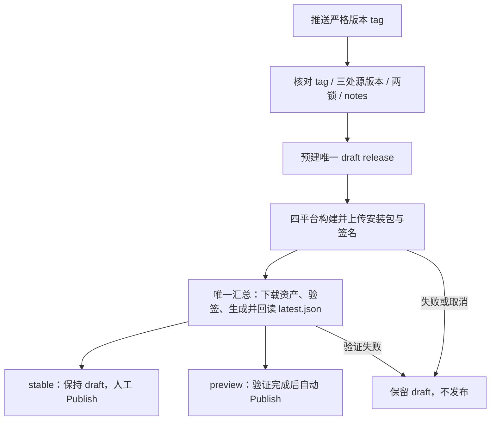

# 发版与构建模块

GitHub Actions 日常质量门（`ci.yml`）+ 发布/updater 工作流（tag 触发构建、RELEASE_NOTES.md 统一 notes、签名、密钥轮换、故障排查）。客户端自动更新行为见 [`update.md`](update.md)。

## 架构概览



## 触发方式

| 事件 | 说明 |
|------|------|
| `push` tag 匹配 `v*`（如 `git push origin v0.x.0`） | stable 流 `publish.yml` 的**构建**触发；`v*-preview*` 经同过滤器 `!` 否定排除（GitHub Actions 禁止 tags 与 tags-ignore 同事件共存，由 preview 流负责） |
| `push` tag 匹配 `v*-preview*`（如 `git push origin v0.x.y-preview.N`） | **preview 流**（`publish-preview.yml`）：每版独立唯一 tag，`prerelease: true`。该流**仅**由此事件触发 |
| release **published** | stable 的补充只读 `verify-release`，不是发布前门禁；使用该 tag 源码的 updater 公钥验证已公开资产 |
| `workflow_dispatch` | stable 输入明确已发布 tag 做只读验证，不重建、不修改 release；preview 无手动入口 |

## Stable 与 Preview 流差异

| 项 | stable（publish.yml） | preview（publish-preview.yml） |
|---|---|---|
| 触发 tag | `v*` + `!v*-preview*` 否定 | `v*-preview*` |
| tag | `v0.6.0`（唯一） | `v0.6.0-preview.N`（**每版唯一，绝不复用**） |
| draft / Publish | 预建 draft，finalize 通过后由开发者 Publish | 预建 draft，全部矩阵及验签通过后 finalize 自动 Publish |
| prerelease | false | **true**（从 `releases/latest` 排除 → stable 用户零污染；API 解析按此筛选） |
| Windows 产物 | NSIS `.exe` + `.msi`（`args: ''`，`targets: all`） | **仅 NSIS**（`args: '--bundles nsis'`；MSI/WiX 只接受数字版本，`0.x.y-preview.N` 的 pre-release 段非数字，bundler 直接拒绝打包——对更新链路零损失，`latest.json` Windows 块本就走 NSIS） |
| latest.json | 矩阵 `uploadUpdaterJson: false`；唯一汇总脚本选择 NSIS 默认键，同时保留 MSI 专用键 | 同一汇总脚本，Windows 只有 NSIS |

预览版本号约定：`0.x.y-preview.N` 属于「下一个核心」——目标 stable 0.6.0 → preview 依次 `0.6.0-preview.1/2/…`，stable 落地即收尾。semver 保证同核心下 preview < stable，preview 用户发布后自动晋升 stable（由 preview 通道双检查实际兑现，见 update.md）。

> preview 仅在交付完成后成为 `prerelease: true` 的非 draft：构建期留 draft，客户端不可见；finalize 成功后公开，API 的 `prerelease && !draft` 筛选自然生效，不暴露部分平台清单。

## 构建矩阵

| Runner | 产物 | 备注 |
|--------|------|------|
| `windows-latest` | NSIS `.exe` + `.msi`（含对应 `.sig`，updater） | 主要分发平台；`createUpdaterArtifacts: true` |
| `ubuntu-22.04` | `.deb` + `.AppImage` | 需 webkit2gtk + libudev 系统依赖 |
| `macos-latest` (aarch64) | `.dmg` + 签名 `.app.tar.gz` | Apple Silicon；安装器归档用于清单验签 |
| `macos-latest` (x86_64) | `.dmg` + 签名 `.app.tar.gz` | Intel Mac；自动更新仍禁用 |

两条流共用同一 4 项矩阵（`fail-fast: false` — 任一平台失败不阻断其他平台）；preview 的 Windows 项改 `--bundles nsis`（见上表差异）。

## 日常质量门（ci.yml）

与发版流**同一套质量门**（`tsc` + vitest + `cargo test --lib`，步骤逐条对应，便于对照排查），但提前到每次 push / PR——发版门禁报红时 tag 已经打完，回滚代价高。此外 `ci.yml` 独有 `e2e` job（playwright）：两条发版流都不跑 e2e。

- **触发**：`push`（`branches: ['**']`，覆盖所有分支）、`pull_request`、`workflow_dispatch`。分支过滤而非裸 `push`：tag push 已由发版流自己的质量门（tsc + vitest + `cargo test --lib`）覆盖，CI 再跑一遍只是重复占 runner。
- **concurrency**：`group: ci-${{ github.workflow }}-${{ github.ref }}`；`cancel-in-progress` 仅对 `pull_request` 为真——同一 PR 的旧运行被新提交取代，分支 push 不取消（避免发布前门禁被中断）。
- **job `frontend`**（ubuntu-latest）：`npm ci` → `npx tsc --noEmit` → `npm run test:run`。
- **job `rust`**（ubuntu-latest）：装 `libwebkit2gtk-4.1-dev` / `libayatana-appindicator3-dev` / `librsvg2-dev` / `patchelf` / `xdg-utils` / `libudev-dev` → Rust stable + rust-cache → `npm ci`（tauri-build 在 test profile 下仍读 `tauri.conf.json`，前端依赖先就位）→ `cargo test --lib --manifest-path src-tauri/Cargo.toml`。`--lib` 在 Linux 上会执行 `#[cfg(not(target_os = "windows"))]` 的串口/TTY 测试，Windows 本地开发环境跑不到——把 Windows-only 之外的分支纳入回归是本 job 的目的。
  - 与发版流的**唯一依赖差异**：发版流跑 ubuntu-22.04 用 `libappindicator3-dev`，本 job 跑 ubuntu-latest（24.04）只能装继任者 `libayatana-appindicator3-dev`（`libappindicator-sys` 优先探测 `ayatana-appindicator3-0.1`，两者提供同一 pkg-config 依赖）。
- **job `e2e`**（ubuntu-latest）：`npx playwright install --with-deps chromium` → `npx playwright test`。e2e 用 mock IPC（`e2e/smoke.spec.ts` 注入 `window.__TAURI_INTERNALS__`），不需要 Rust 侧与 webkit2gtk；`playwright.config.ts` 的 `webServer` 自行拉起 vite dev server（1420），CI 下 `reuseExistingServer=false`。

## 发版操作步骤

```bash
# 1. 同步修改版本号（三处源文件手工改）
#    - package.json → "version": "0.x.0"
#    - src-tauri/tauri.conf.json → "version": "0.x.0"
#    - src-tauri/Cargo.toml → version = "0.x.0"
#    另有两处版本号随工具链同步：src-tauri/Cargo.lock（cargo 生成）与
#    package-lock.json（npm 生成）——触发 tag、五处版本与 notes 首节必须完全一致，
#    scripts/release.mjs preflight 在任何 release 修改前拒绝不一致
# 1b. 编辑 RELEASE_NOTES.md：顶部新章节 # HyperCom vX（本次更新说明；
#     同时成为 GitHub 网页 release notes 和 updater 弹窗文案）
# 2. git add -A && git commit -m "chore: bump version to 0.x.0"
# 3. git tag v0.x.0（preview: git tag v0.x.y-preview.N）
# 4. git push origin main --tags
# 5. 等待 finalize-release 通过：资产完整、安装包及 trusted comment 验签、单次清单上传回读
# 6. stable：仅在 finalize 绿后确认 notes/资产并点 Publish
#    preview：finalize 验证后自动 Publish，无需人工提前公开
```

## Release notes 与 updater 弹窗文案机制

GitHub 网页 release 说明与 updater 弹窗更新说明是**两份独立内容**，但本工作流让它们来自同一个文件 `RELEASE_NOTES.md`，避免不一致：

- `scripts/release.mjs::preflight` 提取顶部当前版本章节并核对触发 tag；`prepare` 将其写入 draft release body。
- `finalize` 从 release body 写 `latest.json.notes`，两者同源；矩阵不再写 release body 或清单。
- `RELEASE_NOTES.md` 是累积式——旧版本章节保留为**历史归档**，不进入 release 描述与弹窗（0.5.1 及更早版本曾 `cat` 全文件受影响）。
- 版本守卫同时核对严格通道 tag、npm/Tauri/Cargo 源版本、npm 锁顶层/根包、Cargo 锁根包和 notes 首节；误推 tag 不会覆盖别的已发布版本。
- notes 在打 tag 前完成；已发布 release 的内容与资产不由构建流程重写，修正须发更高版本。

## Action 版本

`actions/checkout@v5` 与 `actions/setup-node@v5`（v4 声明 node20，GitHub 自 2025-09 弃用会报 `Node.js 20 is deprecated` 警告；v5 声明 node24，纯警告不影响产物；选 v5 而非 v6/v7 是「首个脱离 node20 的稳定 major」）。升级 major 前可用 `gh api repos/<owner>/<repo>/contents/action.yml?ref=vN --jq .content`（base64 解码看 `using:` 行）确认 Node 运行时。

其余动作（发版流与 `ci.yml` 一致）：`dtolnay/rust-toolchain@stable`、`swatinem/rust-cache@v2`（`workspaces: './src-tauri -> target'`）、`tauri-apps/tauri-action@v1`（仅发版流）。

## 发布门禁

1. `prepare-release`：严格 tag/版本/notes 预检，拒绝复用已发布 release；创建或恢复唯一、通道标记正确的 draft，并清除旧 draft 清单。
2. 矩阵：既有 tsc/vitest/Rust 质量门后只上传安装包与 `.sig`，不读改写 `latest.json`。同 tag workflow 串行，失败不取消其他平台。
3. `finalize-release`：即使依赖失败也运行状态检查；只有 prepare/矩阵全部成功才允许发布路径，否则报错并保持 draft。
4. 唯一汇总 `scripts/release.mjs`：使用工作流 token 读取 draft 资产，下载实际安装包与签名，用配置公钥校验 minisign `Ed`/`ED` 签名与 trusted comment；检查四平台、稳定版 MSI、版本、上传状态、大小、签名配对及 tag-pinned `browser_download_url`。
5. 生成 OS/arch 默认键与 installer-specific 键，Windows 默认 NSIS；安装包 URL 使用公开发布下载地址，客户端不消耗资产 REST API 配额。清单上传一次并下载回读验证。
6. stable 维持 draft 等待人工 Publish；preview 只有门禁通过才公开。发布后的只读验证是补充，不能替代 finalize。

匿名无法读 draft；工作流 token 的认证 asset API 用于发布前验签。认证失败时门禁失败、不提前发布。不得以历史某次 401 推断所有身份都无法读取 draft。

本地验证：`node --test scripts/release.test.mjs`；`node scripts/release.mjs preflight stable v<version>`。`local` 命令可在隔离资产目录生成/验签完整清单，无 GitHub 修改；真实 Publish、安装及重启仍需发行环境验收。

## 故障排查

| 症状 | 原因 | 解决 |
|------|------|------|
| workflow 未触发或 preflight 拒绝 | tag/通道/配置版本不一致 | stable 用 `vX.Y.Z`，preview 用 `vX.Y.Z-preview.N`，与五处版本及 notes 完全一致 |
| 构建失败 "signing key not found" | Secret 未配置 | 检查 `TAURI_SIGNING_PRIVATE_KEY` |
| updater 报 "Could not fetch update" | Release 未 Publish | draft 不可被 updater 访问，必须 Publish |
| Release 页面看不到安装包 | Release 还是 draft | draft 不进公开列表，asset 链接是临时 `untagged-*` ID（公开 404），`/latest/` 不认 draft |
| updater 签名验证失败 | 公钥/私钥不匹配 | 重新生成密钥对，更新 tauri.conf.json 的 `pubkey` |
| updater 弹窗更新说明不符 | notes 首节或 draft body 错误 | 打 tag 前准备 notes；finalize 的清单 notes 来自已核对的 release body |
| Linux 构建缺依赖 | 缺系统库 | workflow 已装 `libwebkit2gtk-4.1-dev` + `libudev-dev`；仍报 `libudev-sys` 失败则确认 runner 为 ubuntu-22.04 |
| macOS 公证失败 | 未配置 Apple 证书 | 当前未做代码签名，macOS 用户需手动信任 |
| 矩阵失败/取消 | finalize 状态门禁拒绝发布 | release 保持 draft；修复并重跑失败任务，不提前人工 Publish |
| 资产或签名门禁失败 | 缺平台/签名、下载不完整、版本或公钥不符 | 按脚本错误修复资产/签名并重跑，保持 draft |
| 已发布版本只读验证失败 | 旧 API URL 清单或资产/签名不符 | 不重跑构建覆盖旧发布；安排受验证的新版本，必要时人工修复清单 |

## macOS 与自动更新

macOS 构建照常发布（可手动下载安装），但**自动更新暂不支持**：未签名/公证的 `.app` 带 quarantine 属性会被 Gatekeeper 拦截，更新 relaunch 即失败。启用前置条件 = Apple Developer ID 签名 + 公证（尚未实施，属后续规划）。`verify-release` 仍校验 darwin 键（产物完整性），不代表 macOS 更新可用。

## 签名密钥轮换 SOP（TAURI_SIGNING_PRIVATE_KEY 泄漏/丢失）

updater **先验签名再安装**——直接换 pubkey 会让旧客户端对新签名的 release 验证失败、无法更新，必须两步：

1. **过渡版本**：旧密钥仍有效时，发一个仅把 `tauri.conf.json` `pubkey` 改为新公钥的常规版本（仍用旧密钥签名）→ 旧客户端验签照常通过、升级到过渡版；
2. **切换**：过渡版覆盖装机面后，签名切新密钥（更新仓库 Secrets 的 `TAURI_SIGNING_PRIVATE_KEY` / `TAURI_SIGNING_PRIVATE_KEY_PASSWORD`），后续 release 用新密钥。

跳过过渡版的客户端无法再原地更新（验签失败），只能手动下载安装新版。

## 坏版本召回

- **preview**：直接删除该 release 与 tag → GitHub API 解析自动回落到上一个 preview；已装该版的客户端不受影响（无强制降级），下次检查自然收到新版本。
- **stable**：draft 是缓冲闸；Publish 前必须确认 `finalize-release` 绿与资产齐全。发布后不自动降级/回滚，坏安装版本须 ship-forward 发布更高修复版本。

## 相关文件

| 文件 | 作用 |
|------|------|
| `.github/workflows/ci.yml` | 日常质量门（`push` 所有分支 / `pull_request` / `workflow_dispatch`；`frontend` + `rust` + `e2e` 三个 job，前两者与发版流同口径，`e2e` 为 ci 独有；tag push 不跑） |
| `.github/workflows/publish.yml` | stable：预检→draft→矩阵→finalize 验签/单写清单→人工发布；发布后补充只读验证 |
| `.github/workflows/publish-preview.yml` | preview：相同门禁，finalize 成功后自动公开 prerelease |
| `scripts/release.mjs` / `release.test.mjs` | 共享预检、draft 事务、真实 minisign 验签与公开下载清单；离线消费行为回归 |
| `RELEASE_NOTES.md` | 本次发版说明，构建时写入网页 notes 与 latest.json.notes |
| `src-tauri/tauri.conf.json` | bundle + updater 配置（pubkey / endpoint / installMode passive） |
| `src-tauri/Cargo.toml` / `package.json` | Rust / 前端版本号 |
