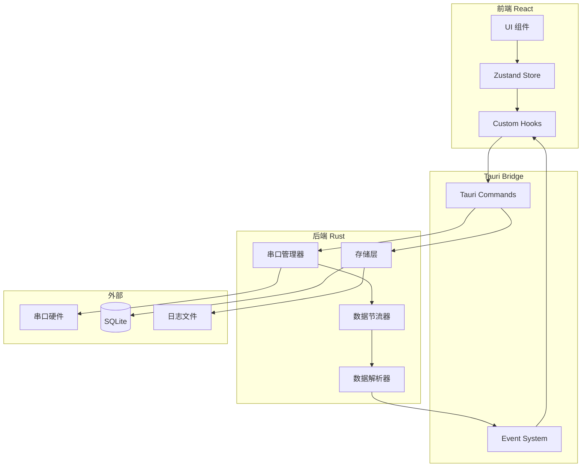

# HyperCom 串口调试工具 - 详细设计文档

## 一、项目概述

HyperCom 是一款现代化的串口调试工具，基于 Tauri v2 + React + Rust 构建，提供高性能的串口通信能力和现代化的用户界面。

### 核心功能

- 串口搜索、连接、配置
- 数据收发（支持 Hex/ASCII 格式）
- 日志存储与导出
- 自定义命令组管理
- 字体和 UI 调整
- 主题切换

---

## 二、项目结构

```
hypercom/
├── src/                          # React 前端源码
│   ├── components/               # UI 组件
│   │   ├── layout/              # 布局组件
│   │   │   ├── Header.tsx       # 顶部导航栏
│   │   │   ├── Sidebar.tsx      # 侧边栏（命令组）
│   │   │   └── MainContent.tsx  # 主内容区
│   │   ├── serial/              # 串口相关组件
│   │   │   ├── SerialConfig.tsx # 串口配置面板
│   │   │   ├── SerialPort.tsx   # 串口选择器
│   │   │   └── DataDisplay.tsx  # 数据显示区
│   │   ├── commands/            # 命令组组件
│   │   │   ├── CommandList.tsx  # 命令列表
│   │   │   └── CommandEditor.tsx# 命令编辑器
│   │   └── settings/            # 设置组件
│   │       ├── FontSettings.tsx # 字体设置
│   │       └── ThemeSettings.tsx# 主题设置
│   ├── hooks/                   # 自定义 Hooks
│   │   ├── useSerial.ts         # 串口操作 Hook
│   │   ├── useSettings.ts       # 设置管理 Hook
│   │   └── useCommands.ts       # 命令组 Hook
│   ├── stores/                  # Zustand 状态管理
│   │   ├── serialStore.ts       # 串口状态
│   │   ├── settingsStore.ts     # 设置状态
│   │   └── commandStore.ts      # 命令组状态
│   ├── types/                   # TypeScript 类型定义
│   │   ├── serial.ts            # 串口相关类型
│   │   ├── command.ts           # 命令相关类型
│   │   └── settings.ts          # 设置相关类型
│   ├── utils/                   # 工具函数
│   │   ├── format.ts            # 数据格式化
│   │   └── storage.ts           # 本地存储
│   ├── App.tsx                  # 根组件
│   ├── main.tsx                 # 入口文件
│   └── index.css                # 全局样式
├── src-tauri/                   # Rust 后端源码
│   ├── src/
│   │   ├── lib.rs               # 库入口
│   │   ├── main.rs              # 主入口
│   │   ├── commands/            # Tauri Commands
│   │   │   ├── mod.rs           # 模块导出
│   │   │   ├── serial.rs        # 串口命令
│   │   │   ├── config.rs        # 配置命令
│   │   │   └── log.rs           # 日志命令
│   │   ├── serial/              # 串口核心逻辑
│   │   │   ├── mod.rs           # 模块导出
│   │   │   ├── manager.rs       # 串口管理器
│   │   │   └── parser.rs        # 数据解析器
│   │   ├── storage/             # 存储层
│   │   │   ├── mod.rs           # 模块导出
│   │   │   ├── database.rs      # SQLite 操作
│   │   │   └── logfile.rs       # 日志文件操作
│   │   └── models/              # 数据模型
│   │       ├── mod.rs           # 模块导出
│   │       ├── serial.rs        # 串口配置模型
│   │       └── command.rs       # 命令模型
│   ├── Cargo.toml               # Rust 依赖配置
│   └── tauri.conf.json          # Tauri 配置
├── plans/                       # 设计文档
├── package.json                 # Node.js 依赖配置
├── vite.config.ts               # Vite 配置
├── tailwind.config.js           # Tailwind CSS 配置
└── tsconfig.json                # TypeScript 配置
```

---

## 三、数据模型设计

### 3.1 串口配置模型

```rust
// src-tauri/src/models/serial.rs

/// 串口配置
#[derive(Debug, Clone, Serialize, Deserialize)]
pub struct SerialConfig {
    /// 串口名称，如 COM3 或 /dev/ttyUSB0
    pub port_name: String,
    /// 波特率
    pub baud_rate: u32,
    /// 数据位
    pub data_bits: DataBits,
    /// 停止位
    pub stop_bits: StopBits,
    /// 校验位
    pub parity: Parity,
    /// 流控制
    pub flow_control: FlowControl,
}

#[derive(Debug, Clone, Serialize, Deserialize)]
pub enum DataBits {
    Five,
    Six,
    Seven,
    Eight,
}

#[derive(Debug, Clone, Serialize, Deserialize)]
pub enum StopBits {
    One,
    OnePointFive,
    Two,
}

#[derive(Debug, Clone, Serialize, Deserialize)]
pub enum Parity {
    None,
    Odd,
    Even,
}

#[derive(Debug, Clone, Serialize, Deserialize)]
pub enum FlowControl {
    None,
    Software,
    Hardware,
}

/// 串口状态
#[derive(Debug, Clone, Serialize, Deserialize, PartialEq)]
pub enum SerialStatus {
    Closed,
    Open,
    Error,
}

/// 串口信息
#[derive(Debug, Clone, Serialize, Deserialize)]
pub struct PortInfo {
    pub name: String,
    pub port_type: String,
    pub manufacturer: Option<String>,
    pub product: Option<String>,
}
```

### 3.2 命令模型

```rust
// src-tauri/src/models/command.rs

/// 单条命令
#[derive(Debug, Clone, Serialize, Deserialize)]
pub struct Command {
    /// 命令 ID
    pub id: String,
    /// 命令名称
    pub name: String,
    /// 命令数据（Hex 格式）
    pub data: String,
    /// 描述
    pub description: Option<String>,
    /// 创建时间
    pub created_at: i64,
}

/// 命令组
#[derive(Debug, Clone, Serialize, Deserialize)]
pub struct CommandGroup {
    /// 组 ID
    pub id: String,
    /// 组名称
    pub name: String,
    /// 命令列表
    pub commands: Vec<Command>,
    /// 创建时间
    pub created_at: i64,
    /// 更新时间
    pub updated_at: i64,
}
```

### 3.3 设置模型

```rust
// src-tauri/src/models/settings.rs

/// 应用设置
#[derive(Debug, Clone, Serialize, Deserialize)]
pub struct AppSettings {
    /// 显示设置
    pub display: DisplaySettings,
    /// 串口默认配置
    pub serial_defaults: SerialConfig,
    /// 日志设置
    pub log: LogSettings,
}

#[derive(Debug, Clone, Serialize, Deserialize)]
pub struct DisplaySettings {
    /// 字体大小
    pub font_size: u32,
    /// 字体家族
    pub font_family: String,
    /// 主题（light/dark）
    pub theme: String,
    /// 显示格式（hex/ascii/mixed）
    pub display_format: String,
}

#[derive(Debug, Clone, Serialize, Deserialize)]
pub struct LogSettings {
    /// 是否启用日志
    pub enabled: bool,
    /// 日志目录
    pub log_dir: String,
    /// 最大文件大小（MB）
    pub max_file_size: u64,
    /// 自动分片
    pub auto_split: bool,
}
```

---

## 四、Tauri Commands API 设计

### 4.1 串口相关命令

| 命令名 | 参数 | 返回值 | 说明 |
|--------|------|--------|------|
| `list_ports` | 无 | `Result<Vec<PortInfo>, String>` | 列出可用串口 |
| `open_port` | `config: SerialConfig` | `Result<(), String>` | 打开串口 |
| `close_port` | 无 | `Result<(), String>` | 关闭串口 |
| `send_data` | `data: String, format: String` | `Result<(), String>` | 发送数据 |
| `get_status` | 无 | `Result<SerialStatus, String>` | 获取串口状态 |

### 4.2 配置相关命令

| 命令名 | 参数 | 返回值 | 说明 |
|--------|------|--------|------|
| `get_settings` | 无 | `Result<AppSettings, String>` | 获取应用设置 |
| `save_settings` | `settings: AppSettings` | `Result<(), String>` | 保存应用设置 |

### 4.3 命令组相关命令

| 命令名 | 参数 | 返回值 | 说明 |
|--------|------|--------|------|
| `list_command_groups` | 无 | `Result<Vec<CommandGroup>, String>` | 获取所有命令组 |
| `save_command_group` | `group: CommandGroup` | `Result<(), String>` | 保存命令组 |
| `delete_command_group` | `id: String` | `Result<(), String>` | 删除命令组 |
| `import_commands` | `json: String` | `Result<Vec<CommandGroup>, String>` | 导入命令组 |
| `export_commands` | `ids: Vec<String>` | `Result<String, String>` | 导出命令组 |

### 4.4 日志相关命令

| 命令名 | 参数 | 返回值 | 说明 |
|--------|------|--------|------|
| `start_logging` | `path: String` | `Result<(), String>` | 开始记录日志 |
| `stop_logging` | 无 | `Result<(), String>` | 停止记录日志 |
| `export_log` | `source: String, target: String` | `Result<(), String>` | 导出日志文件 |

---

## 五、事件系统设计

Tauri 使用事件系统实现 Rust 到前端的数据推送：

### 5.1 事件类型

| 事件名 | 载荷 | 说明 |
|--------|------|------|
| `serial:data-received` | `{ data: string, timestamp: number, format: string }` | 接收到串口数据 |
| `serial:status-changed` | `{ status: SerialStatus }` | 串口状态变化 |
| `serial:error` | `{ message: string }` | 串口错误 |
| `log:rotated` | `{ new_file: string }` | 日志文件分片 |

### 5.2 数据节流机制

```rust
// 在 Rust 后端实现数据节流
pub struct DataThrottler {
    buffer: Vec<u8>,
    last_send: Instant,
    interval: Duration, // 默认 50ms
}

impl DataThrottler {
    pub fn push(&mut self, data: &[u8]) -> Option<Vec<u8>> {
        self.buffer.extend_from_slice(data);
        
        if self.last_send.elapsed() >= self.interval {
            let result = self.buffer.clone();
            self.buffer.clear();
            self.last_send = Instant::now();
            Some(result)
        } else {
            None
        }
    }
}
```

---

## 六、前端组件架构

### 6.1 组件层次结构

```
App
├── Header
│   ├── SerialPortSelector
│   ├── ConnectionStatus
│   └── SettingsButton
├── MainContent
│   ├── SerialConfig
│   │   ├── BaudRateSelect
│   │   ├── DataBitsSelect
│   │   ├── StopBitsSelect
│   │   └── ParitySelect
│   ├── DataDisplay
│   │   ├── ReceivedData (虚拟滚动)
│   │   └── SendInput
│   └── QuickCommands
└── Sidebar (可折叠)
    ├── CommandGroupList
    └── CommandEditor
```

### 6.2 状态管理设计

```typescript
// stores/serialStore.ts
interface SerialState {
  status: SerialStatus;
  ports: PortInfo[];
  config: SerialConfig;
  receivedData: DataPacket[];
  
  // Actions
  refreshPorts: () => Promise<void>;
  connect: (config: SerialConfig) => Promise<void>;
  disconnect: () => Promise<void>;
  sendData: (data: string, format: 'hex' | 'ascii') => Promise<void>;
  clearData: () => void;
}

// stores/commandStore.ts
interface CommandState {
  groups: CommandGroup[];
  activeGroup: string | null;
  
  // Actions
  loadGroups: () => Promise<void>;
  saveGroup: (group: CommandGroup) => Promise<void>;
  deleteGroup: (id: string) => Promise<void>;
  executeCommand: (command: Command) => Promise<void>;
}

// stores/settingsStore.ts
interface SettingsState {
  display: DisplaySettings;
  log: LogSettings;
  
  // Actions
  loadSettings: () => Promise<void>;
  saveSettings: () => Promise<void>;
  updateDisplay: (settings: Partial<DisplaySettings>) => void;
}
```

---

## 七、UI 设计规范

### 7.1 颜色系统

```css
/* 亮色主题 */
:root {
  --background: 0 0% 100%;
  --foreground: 222.2 84% 4.9%;
  --primary: 221.2 83.2% 53.3%;
  --secondary: 210 40% 96%;
  --accent: 210 40% 96%;
  --muted: 210 40% 96%;
  --border: 214.3 31.8% 91.4%;
}

/* 暗色主题 */
.dark {
  --background: 222.2 84% 4.9%;
  --foreground: 210 40% 98%;
  --primary: 217.2 91.2% 59.8%;
  --secondary: 217.2 32.6% 17.5%;
  --accent: 217.2 32.6% 17.5%;
  --muted: 217.2 32.6% 17.5%;
  --border: 217.2 32.6% 17.5%;
}
```

### 7.2 字体系统

```css
:root {
  --font-mono: 'JetBrains Mono', 'Fira Code', 'Consolas', monospace;
  --font-sans: 'Inter', 'Segoe UI', system-ui, sans-serif;
  
  --terminal-font-size: 14px;
  --terminal-line-height: 1.5;
}
```

### 7.3 布局规范

- 主内容区最小宽度：800px
- 侧边栏宽度：280px（可折叠）
- 配置面板高度：auto（可折叠）
- 数据显示区：flex-1（占据剩余空间）

---

## 八、数据库设计

### 8.1 SQLite 表结构

```sql
-- 命令组表
CREATE TABLE command_groups (
    id TEXT PRIMARY KEY,
    name TEXT NOT NULL,
    created_at INTEGER NOT NULL,
    updated_at INTEGER NOT NULL
);

-- 命令表
CREATE TABLE commands (
    id TEXT PRIMARY KEY,
    group_id TEXT NOT NULL,
    name TEXT NOT NULL,
    data TEXT NOT NULL,
    description TEXT,
    sort_order INTEGER DEFAULT 0,
    created_at INTEGER NOT NULL,
    FOREIGN KEY (group_id) REFERENCES command_groups(id) ON DELETE CASCADE
);

-- 设置表
CREATE TABLE settings (
    key TEXT PRIMARY KEY,
    value TEXT NOT NULL
);

-- 索引
CREATE INDEX idx_commands_group_id ON commands(group_id);
```

---

## 九、开发阶段划分

### 阶段一：项目初始化
- 创建 Tauri v2 项目
- 配置前端构建工具（Vite + React + TypeScript）
- 配置 Tailwind CSS
- 配置 Rust 依赖

### 阶段二：串口核心功能
- 实现串口管理器
- 实现数据节流器
- 实现 Tauri Commands
- 前端串口状态管理

### 阶段三：UI 框架搭建
- 实现布局组件
- 实现串口配置面板
- 实现数据显示组件（含虚拟滚动）
- 实现发送功能

### 阶段四：高级功能
- 日志存储功能
- 命令组管理
- 设置持久化
- 主题切换

### 阶段五：优化与测试
- 性能优化
- 错误处理完善
- 用户测试

---

## 十、依赖清单

### 10.1 Rust 依赖

```toml
[dependencies]
tauri = { version = "2", features = ["devtools"] }
tauri-plugin-shell = "2"
serde = { version = "1", features = ["derive"] }
serde_json = "1"
serialport = "4"
tokio = { version = "1", features = ["full"] }
sqlx = { version = "0.7", features = ["runtime-tokio", "sqlite"] }
chrono = { version = "0.4", features = ["serde"] }
uuid = { version = "1", features = ["v4"] }
thiserror = "1"
```

### 10.2 前端依赖

```json
{
  "dependencies": {
    "react": "^18",
    "react-dom": "^18",
    "zustand": "^4",
    "@tanstack/react-virtual": "^3",
    "lucide-react": "^0.300",
    "clsx": "^2",
    "tailwind-merge": "^2"
  },
  "devDependencies": {
    "@tauri-apps/cli": "^2",
    "@types/react": "^18",
    "@types/react-dom": "^18",
    "typescript": "^5",
    "vite": "^5",
    "@vitejs/plugin-react": "^4",
    "tailwindcss": "^3",
    "autoprefixer": "^10",
    "postcss": "^8"
  }
}
```

---

## 十一、架构图



---

## 十二、总结

本设计文档详细描述了 HyperCom 串口调试工具的技术架构，包括：

1. **清晰的项目结构** - 前后端分离，模块化设计
2. **完整的数据模型** - 覆盖串口配置、命令组、设置等
3. **明确的 API 设计** - Tauri Commands 接口规范
4. **高效的事件系统** - 数据节流避免 UI 卡顿
5. **可扩展的 UI 架构** - 组件化、状态管理清晰

该架构能够支撑一个高性能、现代化的串口调试工具的开发。
